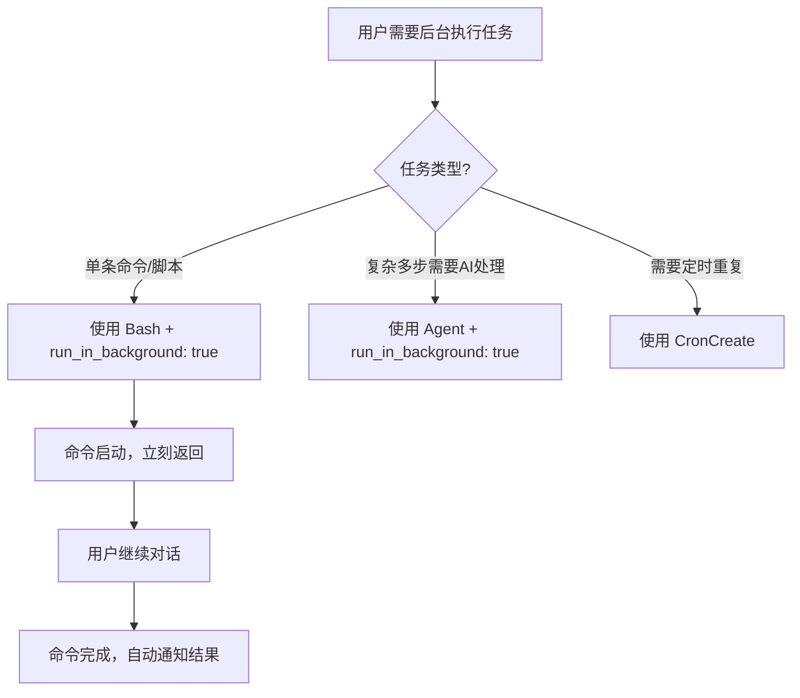

# Claude Code 后台任务执行指南

在 Claude Code 对话中，有时候需要**执行长时间任务/后台任务**，同时不阻塞当前对话，可以继续和 AI 交流。本文介绍几种常用方法。

## 方法一：Bash 后台执行（推荐，最简单）

### 使用方式
给 `Bash` 工具添加 `run_in_background: true` 参数：

```json
{
  "name": "Bash",
  "parameters": {
    "command": "git add . && git commit -m 'update' && git push",
    "description": "Commit and push changes",
    "run_in_background": true
  }
}
```

### 特点
- ✅ 最简单直接
- ✅ 命令执行完自动通知你结果
- ✅ 不阻塞当前对话，启动后立刻可以继续聊天
- ✅ 适合：git 提交推送、编译、打包、自动化脚本等非交互式任务

### 完整例子
```
我需要后台推送当前修改，你帮我启动：

- 提交所有改动
- 推送远端

Bash 后台执行就行。
```

## 方法二：Agent 子代理后台执行

### 使用方式
用 `Agent` 工具，设置 `run_in_background: true`：

```json
{
  "name": "Agent",
  "parameters": {
    "description": "Run build and test suite",
    "prompt": "cd /path/to/project && ./build.sh && make test",
    "subagent_type": "general-purpose",
    "run_in_background": true
  }
}
```

### 特点
- ✅ 子代理可以做复杂多步任务（不止是一条 shell 命令）
- ✅ 可以让子代理处理整个任务流程
- ✅ 同样后台运行，不阻塞主对话
- ✅ 适合：复杂重构、批量处理、需要子代理思考的任务

## 方法三：Cron 定时任务（周期性任务）

如果你需要**定时重复执行**（比如每天检查更新），用 `CronCreate`：

```json
{
  "name": "CronCreate",
  "parameters": {
    "cron": "0 9 * * *",
    "prompt": "cd /path/to/project && git pull",
    "recurring": true,
    "durable": true
  }
}
```

- cron 语法：`分钟 小时 日 月 周`
- `recurring: true` 重复执行
- `durable: true` 保存到磁盘，重启后依然保留

## 常用场景

| 场景 | 推荐方法 |
|------|---------|
| git commit/push | Bash 后台 |
| 编译/构建/测试 | Bash 后台 |
| 批量文件处理 | Bash 后台 |
| 复杂多步重构 | Agent 后台 |
| 定时拉更新/清理 | Cron |
| 长期监控任务 | Cron |

## 注意事项

1. **交互式命令不能后台**：需要用户输入（比如 `vim`、`git rebase -i`）不能放后台，因为没人输入会卡住
2. **后台任务只有一次**：`Bash` 和 `Agent` 后台都是一次性执行，不是周期性的。周期性用 `Cron`
3. **结果会通知**：不管成功失败，执行完都会在对话里通知你
4. **不占对话上下文**：后台任务运行时，主对话不受影响，可以正常继续

## 工作流程图



## 实际例子

### 例子 1：后台提交 git

```
{
  "name": "Bash",
  "parameters": {
    "command": "cd plugin/vimCode2Prompt && git add . && git commit -m 'fix: correct file/directory detection' && git push",
    "description": "Commit fixes to vimCode2Prompt submodule",
    "run_in_background": true
  }
}
```

### 例子 2：子代理后台重构代码

```
{
  "name": "Agent",
  "parameters": {
    "description": "Refactor old code to Vim9 syntax",
    "prompt": "Go through all *.vim files in plugin/, convert legacy syntax to Vim9 script syntax, keep functionality unchanged. Commit changes when done.",
    "subagent_type": "general-purpose",
    "run_in_background": true
  }
}
```
