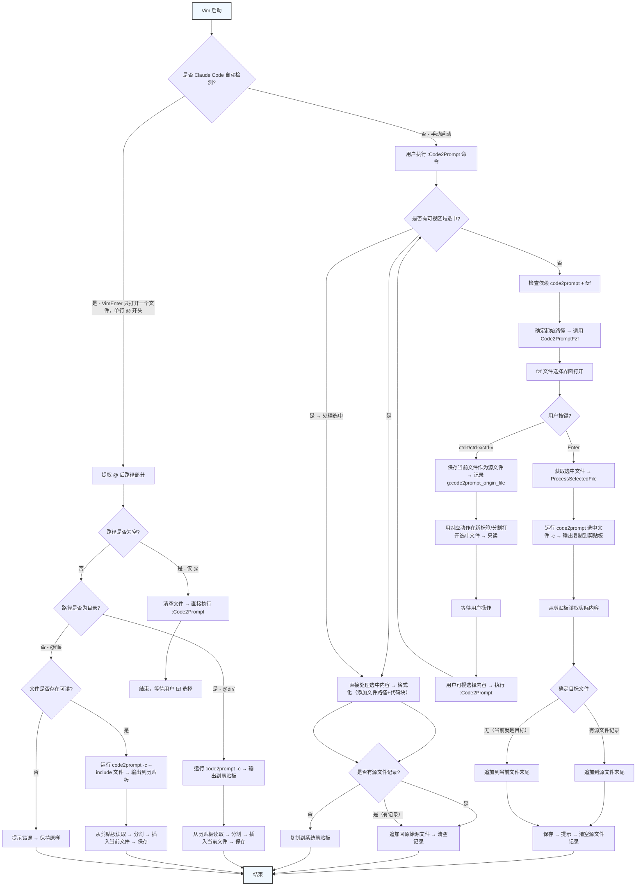
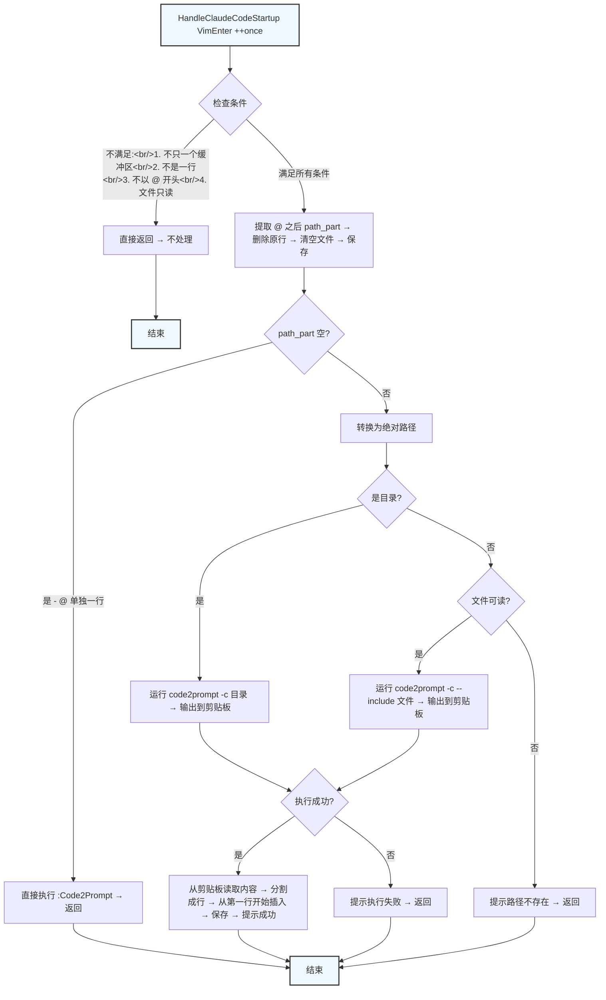
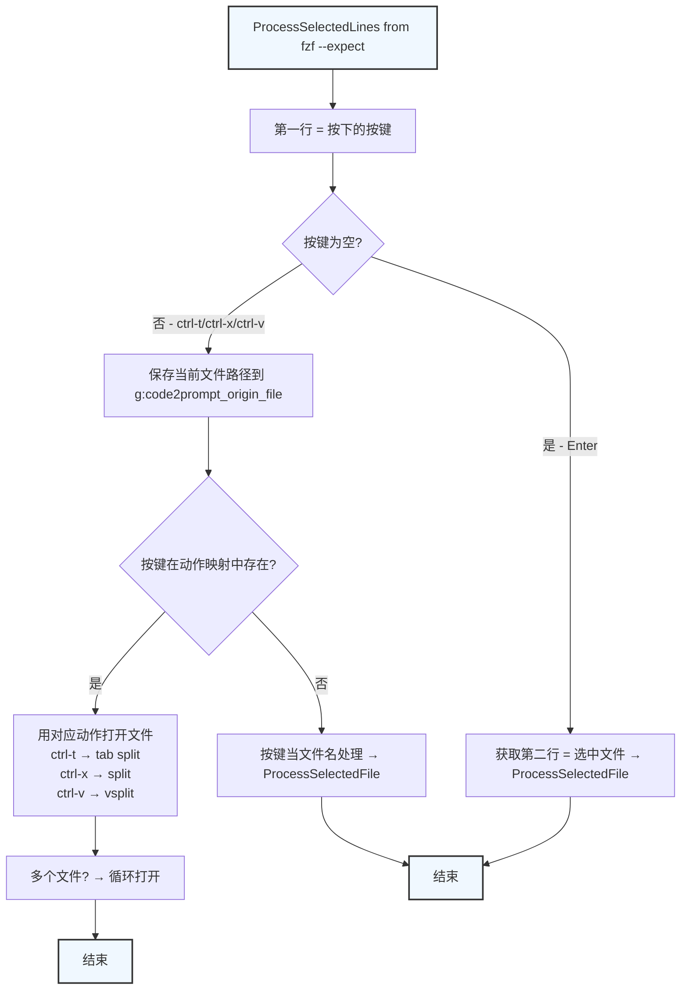
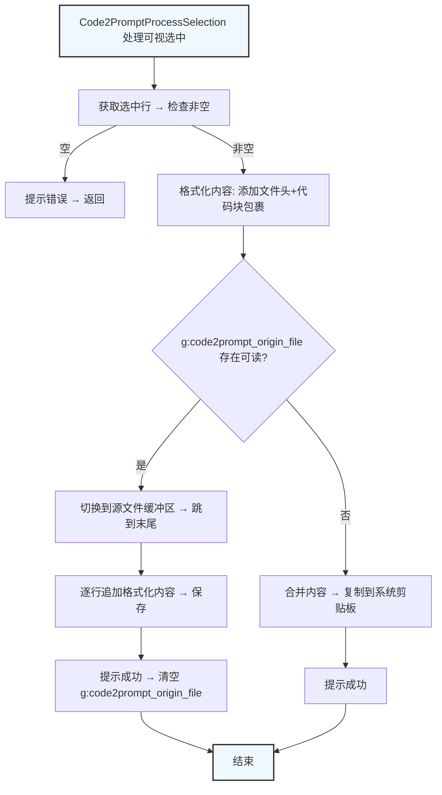

# vimCode2Prompt 处理流程图

## 整体执行流程

```mermaid
flowchart TD
    A[Vim 启动] --> B{是否 Claude Code 自动检测?}
    B -->|"是 - VimEnter 只打开一个文件，单行 @ 开头"| C[提取 @ 后路径部分]
    C --> D{路径是否为空?}
    D -->|是 - 仅 @| E[清空文件 → 直接执行 :Code2Prompt]
    D -->|否| F{路径是否为目录?}
    F -->|是 - @dir/| G[运行 code2prompt -c → 输出到剪贴板]
    G --> H[从剪贴板读取 → 分割 → 插入当前文件 → 保存]
    F -->|否 - @file| I{文件是否存在可读?}
    I -->|是| J[运行 code2prompt -c --include 文件 → 输出到剪贴板]
    J --> K[从剪贴板读取 → 分割 → 插入当前文件 → 保存]
    I -->|否| L[提示错误 → 保持原样]
    E --> M[结束，等待用户 fzf 选择]

    B -->|"否 - 手动启动"| N[用户执行 :Code2Prompt 命令]
    N --> O{是否有可视区域选中?}
    O -->|是| P["直接处理选中内容 → 格式化（添加文件路径+代码块）"]
    P --> Q{是否有源文件记录?}
    Q -->|是| R[追加到源文件末尾 → 清空记录]
    Q -->|否| S[复制到系统剪贴板]
    O -->|否| T[检查依赖 code2prompt + fzf]
    T --> U[确定起始路径 → 调用 Code2PromptFzf]
    U --> V[fzf 文件选择界面打开]

    V --> W{用户按键?}
    W -->|Enter| X[获取选中文件 → ProcessSelectedFile]
    X --> Y[运行 code2prompt 选中文件 -c → 输出复制到剪贴板]
    Y --> Z[从剪贴板读取实际内容]
    Z --> AA{确定目标文件}
    AA -->|有源文件记录| BB[追加到源文件末尾]
    AA -->|"无（当前就是目标）"| CC[追加到当前文件末尾]
    BB --> DD[保存 → 提示 → 清空源文件记录]
    CC --> DD
    DD --> EE[结束]

    W -->|ctrl-t/ctrl-x/ctrl-v| FF[保存当前文件作为源文件 → 记录 g:code2prompt_origin_file]
    FF --> GG[用对应动作在新标签/分割打开选中文件 → 只读]
    GG --> HH[等待用户操作]

    HH --> II[用户可视选择内容 → 执行 :Code2Prompt]
    II --> O
    O -->|是 → 处理选中| P
    P --> Q
    Q -->|"是（有记录）"| R[追加回原始源文件 → 清空记录]
    R --> EE

    S --> EE
    H --> EE
    K --> EE
    L --> EE

    classDef startend fill:#f0f8ff,stroke:#333,stroke-width:2px
    class A,EE startend
```

## ProcessSelectedFile 详细流程

```mermaid
flowchart TD
    A["ProcessSelectedFile(abs_path)"] --> B[检查文件是否可读]
    B -->|不存在| C[提示错误 → 返回]
    B -->|存在| D[构造 code2prompt 命令:<br>code2prompt dir --include file -l --absolute-paths -c]
    D --> E[执行命令 → 获取 stdout]
    E --> F{shell 错误?}
    F -->|是| G[提示错误 → 返回]
    F -->|否| H["从系统剪贴板读取实际内容&lt;br/&gt;macOS: pbpaste | Linux: xclip | 回退: getreg('*')"]
    H --> I{确定目标源文件}
    I -->|g:code2prompt_origin_file 存在可读| J[目标 = 记录的源文件]
    I -->|否则| K[目标 = 当前缓冲区文件]
    J --> L{目标有效且剪贴板非空?}
    K --> L
    L -->|否| M[只保留剪贴板 → 提示 → 返回]
    L -->|是| N[分割剪贴板内容为行]
    N --> O[切换到目标缓冲区 → 保存原视图]
    O --> P[跳到文件末尾]
    P --> Q{文件末尾不为空?}
    Q -->|是| R[先追加一个空行]
    Q -->|否| S[文件为空，从第一行开始]
    R --> T[逐行追加到末尾]
    S --> T
    T --> U[保存文件 → 恢复视图]
    U --> V[提示成功 → 清空 g:code2prompt_origin_file]
    V --> W[结束]

    classDef startend fill:#f0f8ff,stroke:#333,stroke-width:2px
    class A,W startend
```

## Claude Code 自动检测启动流程

```mermaid
flowchart TD
    A[HandleClaudeCodeStartup VimEnter ++once] --> B{检查条件}
    B -->|"不满足:&lt;br/&gt;1. 不只一个缓冲区&lt;br/&gt;2. 不是一行&lt;br/&gt;3. 不以 @ 开头&lt;br/&gt;4. 文件只读"| C[直接返回 → 不处理]
    B -->|满足所有条件| D[提取 @ 之后 path_part → 删除原行 → 清空文件 → 保存]
    D --> E{path_part 空?}
    E -->|是 - @ 单独一行| F[直接执行 :Code2Prompt → 返回]
    E -->|否| G[转换为绝对路径]
    G --> H{是目录?}
    H -->|是| I[运行 code2prompt -c 目录 → 输出到剪贴板]
    H -->|否| J{文件可读?}
    J -->|是| K[运行 code2prompt -c --include 文件 → 输出到剪贴板]
    J -->|否| L[提示路径不存在 → 返回]
    I --> M{执行成功?}
    K --> M
    M -->|是| N[从剪贴板读取内容 → 分割成行 → 从第一行开始插入 → 保存 → 提示成功]
    M -->|否| O[提示执行失败 → 返回]
    N --> P[结束]
    C --> Q[结束]
    F --> P
    L --> P
    O --> P

    classDef startend fill:#f0f8ff,stroke:#333,stroke-width:2px
    class A,P,Q startend
```

## fzf 按键处理流程

```mermaid
flowchart TD
    A["ProcessSelectedLines from fzf --expect"] --> B[第一行 = 按下的按键]
    B --> C{按键为空?}
    C -->|是 - Enter| D[获取第二行 = 选中文件 → ProcessSelectedFile]
    C -->|否 - ctrl-t/ctrl-x/ctrl-v| E[保存当前文件路径到 g:code2prompt_origin_file]
    E --> F{按键在动作映射中存在?}
    F -->|是| G[用对应动作打开文件<br>ctrl-t → tab split<br>ctrl-x → split<br>ctrl-v → vsplit]
    F -->|否| H[按键当文件名处理 → ProcessSelectedFile]
    G --> I[多个文件? → 循环打开]
    I --> J[结束]
    D --> K[结束]
    H --> K

    classDef startend fill:#f0f8ff,stroke:#333,stroke-width:2px
    class A,J,K startend
```

## 可视区域选择处理流程

```mermaid
flowchart TD
    A[Code2PromptProcessSelection 处理可视选中] --> B[获取选中行 → 检查非空]
    B -->|空| C[提示错误 → 返回]
    B -->|非空| D[格式化内容: 添加文件头+代码块包裹]
    D --> E{g:code2prompt_origin_file 存在可读?}
    E -->|是| F[切换到源文件缓冲区 → 跳到末尾]
    F --> G[逐行追加格式化内容 → 保存]
    G --> H[提示成功 → 清空 g:code2prompt_origin_file]
    E -->|否| I[合并内容 → 复制到系统剪贴板]
    I --> J[提示成功]
    H --> K[结束]
    J --> K

    classDef startend fill:#f0f8ff,stroke:#333,stroke-width:2px
    class A,K startend
```
