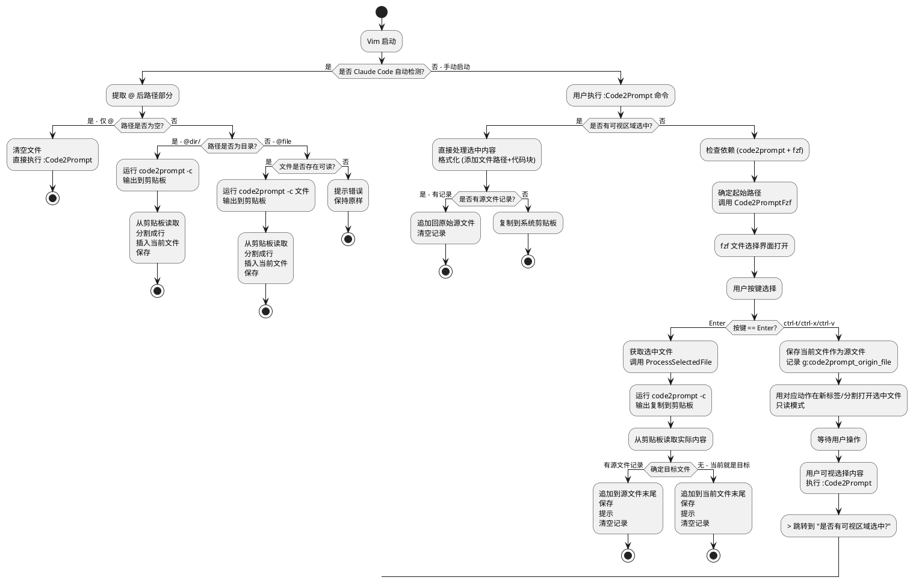
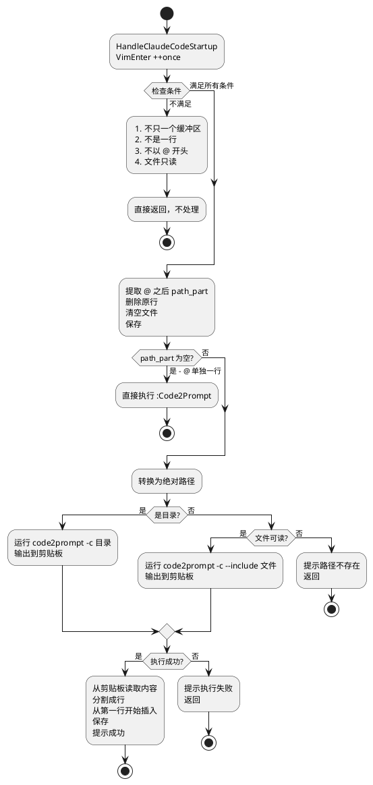
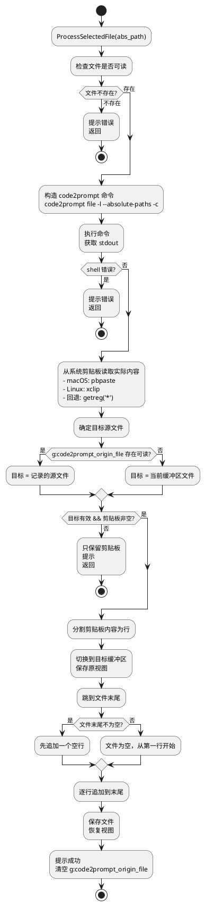
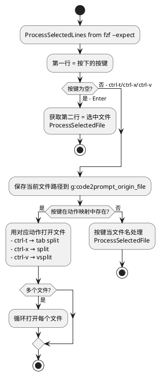
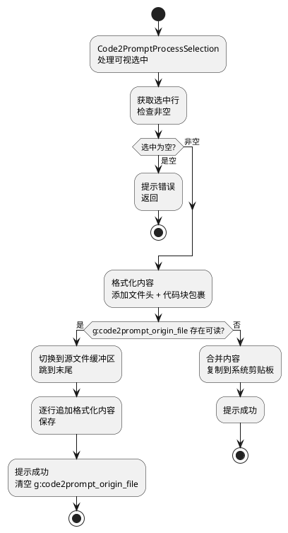

# vimCode2Prompt 处理流程图

## 整体执行流程

```plantuml
@startuml vimCode2Prompt 整体流程
start

:Vim 启动;

if (是否 Claude Code 自动检测?) then (是)
  :提取 @ 后路径部分;
  if (路径是否为空?) then (是 - 仅 @)
    :清空文件\n直接执行 :Code2Prompt;
    stop
  else (否)
    if (路径是否为目录?) then (是 - @dir/)
      :运行 code2prompt -c\n输出到剪贴板;
      :从剪贴板读取\n分割成行\n插入当前文件\n保存;
      stop
    else (否 - @file)
      if (文件是否存在可读?) then (是)
        :运行 code2prompt -c 文件\n输出到剪贴板;
        :从剪贴板读取\n分割成行\n插入当前文件\n保存;
        stop
      else (否)
        :提示错误\n保持原样;
        stop
      endif
    endif
  endif
else (否 - 手动启动)
  :用户执行 :Code2Prompt 命令;
  if (是否有可视区域选中?) then (是)
    :直接处理选中内容\n格式化 (添加文件路径+代码块);
    if (是否有源文件记录?) then (是 - 有记录)
      :追加回原始源文件\n清空记录;
      stop
    else (否)
      :复制到系统剪贴板;
      stop
    endif
  else (否)
    :检查依赖 (code2prompt + fzf);
    :确定起始路径\n调用 Code2PromptFzf;
    :fzf 文件选择界面打开;
    :用户按键选择;
    if (按键 == Enter?) then (Enter)
      :获取选中文件\n调用 ProcessSelectedFile;
      :运行 code2prompt -c\n输出复制到剪贴板;
      :从剪贴板读取实际内容;
      if (确定目标文件) then (有源文件记录)
        :追加到源文件末尾\n保存\n提示\n清空记录;
        stop
      else (无 - 当前就是目标)
        :追加到当前文件末尾\n保存\n提示\n清空记录;
        stop
      endif
    else (ctrl-t/ctrl-x/ctrl-v)
      :保存当前文件作为源文件\n记录 g:code2prompt_origin_file;
      :用对应动作在新标签/分割打开选中文件\n只读模式;
      :等待用户操作;
      :用户可视选择内容\n执行 :Code2Prompt;
      -> 跳转到 "是否有可视区域选中?"
    endif
  endif
endif

@enduml
```

## Claude Code 自动检测启动流程

```plantuml
@startuml Claude Code 自动检测启动流程
start

:HandleClaudeCodeStartup\nVimEnter ++once;

if (检查条件) then (不满足)
  : 1. 不只一个缓冲区\n 2. 不是一行\n 3. 不以 @ 开头\n 4. 文件只读;
  :直接返回，不处理;
  stop
else (满足所有条件)
endif

:提取 @ 之后 path_part\n删除原行\n清空文件\n保存;

if (path_part 为空?) then (是 - @ 单独一行)
  :直接执行 :Code2Prompt;
  stop
else (否)
endif

:转换为绝对路径;

if (是目录?) then (是)
  :运行 code2prompt -c 目录\n输出到剪贴板;
else (否)
  if (文件可读?) then (是)
    :运行 code2prompt -c --include 文件\n输出到剪贴板;
  else (否)
    :提示路径不存在\n返回;
    stop
  endif
endif

if (执行成功?) then (是)
  :从剪贴板读取内容\n分割成行\n从第一行开始插入\n保存\n提示成功;
  stop
else (否)
  :提示执行失败\n返回;
  stop
endif

@enduml
```

## ProcessSelectedFile 详细流程

```plantuml
@startuml ProcessSelectedFile 详细流程
start

:ProcessSelectedFile(abs_path);

:检查文件是否可读;

if (文件不存在?) then (不存在)
  :提示错误\n返回;
  stop
else (存在)
endif

:构造 code2prompt 命令\ncode2prompt file -l --absolute-paths -c;

:执行命令\n获取 stdout;

if (shell 错误?) then (是)
  :提示错误\n返回;
  stop
else (否)
endif

:从系统剪贴板读取实际内容\n- macOS: pbpaste\n- Linux: xclip\n- 回退: getreg('*');

:确定目标源文件;

if (g:code2prompt_origin_file 存在可读?) then (是)
  :目标 = 记录的源文件;
else (否)
  :目标 = 当前缓冲区文件;
endif

if (目标有效 && 剪贴板非空?) then (否)
  :只保留剪贴板\n提示\n返回;
  stop
else (是)
endif

:分割剪贴板内容为行;

:切换到目标缓冲区\n保存原视图;

:跳到文件末尾;

if (文件末尾不为空?) then (是)
  :先追加一个空行;
else (否)
  :文件为空，从第一行开始;
endif

:逐行追加到末尾;

:保存文件\n恢复视图;

:提示成功\n清空 g:code2prompt_origin_file;

stop

@enduml
```

## fzf 按键处理流程

```plantuml
@startuml fzf 按键处理流程
start

:ProcessSelectedLines from fzf --expect;

:第一行 = 按下的按键;

if (按键为空?) then (是 - Enter)
  :获取第二行 = 选中文件\nProcessSelectedFile;
  stop
else (否 - ctrl-t/ctrl-x/ctrl-v)
endif

:保存当前文件路径到 g:code2prompt_origin_file;

if (按键在动作映射中存在?) then (是)
  :用对应动作打开文件\n- ctrl-t → tab split\n- ctrl-x → split\n- ctrl-v → vsplit;
  if (多个文件?) then (是)
    :循环打开每个文件;
  endif
  stop
else (否)
  :按键当文件名处理\nProcessSelectedFile;
  stop
endif

@enduml
```

## 可视区域选择处理流程

```plantuml
@startuml 可视区域选择处理流程
start

:Code2PromptProcessSelection\n处理可视选中;

:获取选中行\n检查非空;

if (选中为空?) then (是空)
  :提示错误\n返回;
  stop
else (非空)
endif

:格式化内容\n添加文件头 + 代码块包裹;

if (g:code2prompt_origin_file 存在可读?) then (是)
  :切换到源文件缓冲区\n跳到末尾;
  :逐行追加格式化内容\n保存;
  :提示成功\n清空 g:code2prompt_origin_file;
  stop
else (否)
  :合并内容\n复制到系统剪贴板;
  :提示成功;
  stop
endif

@enduml
```
